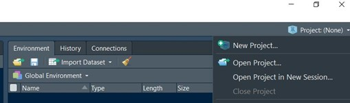

# T4J
Materials used for teaching Tidyverse for Journalists 

The content below is intended as a memory jogger for people to us to consolidate their learning, which will normally have begun in a trainer-led session, online or in person. 


# R Workbook - Tidyverse for Journalists
## by Luuk Sengers and Jonathan Stoneman


##1. Get R up and running 
If you don't have R yet you can download and install it from: [https://cloud.r-project.org](https://cloud.r-project.org)
You also need a local copy of RStudio, which you can download and install from: [https://www.rstudio.com/products/rstudio/download](https://www.rstudio.com/products/rstudio/download) (select the free version)


# Exploring your RStudio panes
Open R Studio


Open a new project: Click  and choose: “New Directory”. 
Name it R_Training

```{r, echo=FALSE}

```


Open a new script: Click  and choose: “R Script”

Save the script: Click 	    name it “R_session_1” and save it in the same directory as the project. (R will do this as a default)


## 2. Exploring the panes and tabs

```{r, echo=FALSE}

```

## 3. Installing and loading packages

Let's start by making sure we have the tidyverse - write/copy into your script:

`install.packages("tidyverse")`
`install.packages("writexl")`

Now put the cursor anywhere in the second sentence and click "run": this executes your first R script!

Notes:
•	R comes with open source packages, created by programmers to ease our work and to make scripts shorter and easier to understand. 
•	Tidyverse is the most commonly used package. It contains everything we need to analyse data (for now, at least).
•	Actually, you have just written script and notes. Putting a # in front of your notes (usually a question or a command) makes sure that R does not recognise them as code and will not include them in the script. The noting option is highly convenient, as we will see.

Next: Write/copy into the script:

# Load packages


```{r eval=FALSE, include=TRUE}
library(tidyverse)
library(readxl) 
library(writexl)
```

Notes:
•	You need to install packages only once, but you need to load them with the code library("packagename") every time you run an Rstudio session. 
•	Readxl is part of Tidyverse but has to be loaded separately.
•	This time use a shortcut to run it: put the cursor anywhere in the second sentence and press CTRL+Enter, or Command+Enter on a Mac.


4. Setting a working directory 

```{r, echo=FALSE}

```
Top left, where you create New (file, script, project – choose project and follow the steps)


Notes:
•	Although you can navigate your hard drive to find files, it is good practice to work in one directory, where all the relevant files are. In fact, it is very good practice to work in a project. That way the resulting Rproject file creates a kind of wrapper, where all your scripts, notes and datasets will live together, but neatly separated from the ones used in other projects. When you create or open a project R Studio will automatically set that folder as its working directory for the session. 
•	The menus for project creating, opening, and management are in the two top corners of your screen (left or right, depending on your preference) 

5. Importing a dataset in R

To get the data we will be using in this workbook, go to :
[https://github.com/Stonepeople/T4J/tree/main/T4J_session_data](https://github.com/Stonepeople/T4J/tree/main/T4J_session_data). For this part of the session you need to download a copy of [facility16.zip](https://github.com/Stonepeople/T4J/blob/main/T4J_session_data/FACILITY16.zip)

You will need to unzip the folder, using the "browse" option to navigate to the project folder you created in section 1, and extract all the files to that folder.  

# Import dataset
Write/copy into the script:

``` {r eval=FALSE, include=TRUE}
pollution <- read_csv("pollution16.csv")
```

Note: Base R only works with .csv files. You will need other packages to import other file types. In this course we use readxl to handle xls and xlsx. Because .xls files include various worksheets, you will need to specify which worksheet of the file you wish to import.

If you are used to working in Excel or Google sheets, it may be a little disconcerting to start looking at your data in R without being able to see much of it. In Excel, for example, you probably like to scroll up and down a few columns and see what’s in there, perhaps using the filter option to get a list of contents of the columns you’re interested in. And you may well need to scroll right and left to see what variables you have. 

In R it’s really easy; there are two simple verbs you need to use. 
If you type `names(nameofdataset)` you will see a list in the Console pane, showing the names of each column, and the column number (this will be very helpful in selecting the ones you want to concentrate on, when we come to the `select()` function soon)

To get an idea of how many of each possible entry there are in the columns themselves, you use the `count()` function. This will print to the Console a list of each item in the chosen column, and the number of times that item appears – so, to see how many polluting facilities are registered in each EU country in this register you would type
 
```{r eval=FALSE, include=TRUE}
pollution %>%  count(CountryName, sort = TRUE)
```
 
 Try it


6. The basic Tidyverse functions (or verbs)
There are nine basic Tidyverse functions that will do most of the work for you. (An extended overview of all the functions in R that we use, can be found in appendix A.)

1.	`Table2 <- Table1`
2.	`select(Column1, Column2, Column3)`
3.	`filter(Column1 == "Condition")`
4.	`filter(Column1 == "Condition1" | Column1 == "Condition2")`
5.	`filter(Column1 == “Condition1", Column2 == "Condition2")`
6.	`filter(str_detect(Column1, "pattern")`
7.	`group_by(Column1, Column2)`
8.	`summarise(Total = n())`
9.	`arrange(Column1)` or `arrange(desc(Column1))`

7-9 work together to produce the equivalent of a pivot table. In fact, `group_by()` on its own has no visible effect – it has to be followed by some other instruction, quite often summarise(). Think of it like creating an empty pivot table – this is pointless until you decide which values you want to summarise. 

Write/copy into the script (and replace “MyCountry” by the country name of your choice. Note that the dataset contains only EU-countries) There is a find and replace button in the toolbar at the top of the script pane. You could save time by replacing MyCountry with your chosen country now :

# Show all installations in my country
```{r eval=FALSE, include=TRUE}
total_mycountry <- pollution %>%
  filter(CountryName == "MyCountry")
```

Notes:
•	We have marked the new functions in red. This color has no effect on the script and disappears when copied into R
•	`==` means “has” (we need two = because one on its own simply assigns the value after the = to the value in front of it, just like <-)
•	`%>%` is a "pipe". It means “and then…” It always comes at the end of the line and must be followed by a new instruction on the next line. 

# Show all installations in my country in 2017

```{r eval=FALSE, include=TRUE}
Total17 <- Total %>%
  filter(ReportingYear == "2017")

```


Note: We build a new table based on an older one

# Show all livestock farms in my country in 2017

```{r eval=FALSE, include=TRUE}
Livestock17 <- Total17 %>%
  filter(str_detect(MainIASectorName, "livestock"))

```


Note: “livestock” is not a value but a string from within a value.

# Show only the names of the livestock farms and the cities where they are located in my country

```{r eval=FALSE, include=TRUE}
NameCity <- Livestock17 %>%
  select(4,7)

```

Note: Instead of the names of the columns we are specifying the positions: `select("ParentCompanyName", "City")` would also work.

# Show all installations in my country that emit NOx (nitrogen), with names and quantities
```{r eval=FALSE, include=TRUE}

NOX17 <- Pol %>%
  filter(CountryName == "MyCountry", ReportingYear == “2017”, str_detect(PollutantName, "NOx")) %>%
  select(FacilityName,TotalQuantity)

```

Note: You can glue the filters together with commas

# Which installation emitted the most NOx?

``` {r eval=FALSE, include=TRUE}
NOX17 <- NOX17 %>%
  arrange(desc(TotalQuantity))

```


# How many installations per sector emit NOx?
```{r eval=FALSE, include=TRUE}
NOX17SectorCount <- Total17 %>%
  filter(str_detect(PollutantName, "NOx")) %>%
   group_by(MainIASectorName) %>%
  summarise(Total = n()) %>%
  arrange(desc(Total))

```


Note: “Total” is a name we give to the column expressing the totals of the count. We can use almost any name, as long as we tell R what the column equals - eg `Total = n()` 

# Which sector emits most nitrogen and how much?

```{r eval=FALSE, include=TRUE}
NOX17SectorSum <- Total17 %>%
  filter(str_detect(PollutantName, "NOx")) %>%
  group_by(MainIASectorName) %>%
  summarise(Total = sum(TotalQuantity, na.rm=TRUE)) %>%
  arrange(desc(Total))
```


7. Exporting a dataset
# Export table to csv

`Write_csv(Total17, "Polluters.csv")`

# Export table to xlsx

`write_xlsx(Total17, "Polluters.xlsx")`

Why might we want to export a file at this stage? After all, we haven’t done much more than import it and get it ready for analysis. It is often worth saving a dataframe as a file so you can start from that point in your next session. This is especially worthwhile when we import files from websites – we may not have internet connectivity next time we want to work on the data, or we may want to be sure we are using the same data – just in case the publisher removes or changes it. 

8. Inspecting the dataset
Write/copy into the script:

# View table “Total17”

`View(Total17)`

Note: Unlike almost all the other functions in R, “View” must be written with a capital “V”.

Or simply click on the grid icon next to `Total17` in the Environment pane:


# Show all the column names (=variables) in table ‘Total17’

`names(Total17)`

# Show all the unique values in the column ‘PollutantName’
`unique(Total17$PollutantName)` 

# Save the unique values as a list (for reference)
`Pollutants <- unique(Total17$PollutantName)`
`View(Pollutants)`

# Group, count and sort the values in the column ‘CountryName’

```{r eval=FALSE, include=TRUE}
Pollution %>% 
count(CountryName, sort = TRUE)

```


# Show the top-10 of ‘NOX17’

```{r eval = FALSE, include = TRUE}

head(NOX17, 10)

```


# Show the last 10 in the tail of ‘NOX17’

`tail(NOX17, 10)`

8. Statistics
Now we get to some really useful analyses. Most data stories are built on statistics.

Summary statistics

# Show minimum, maximum, mean and median of the quantities in the table `NOX17`

`summary(NOX17$TotalQuantity)`

Note: `summary`, not `summarise` Try each of them, and observe the difference - we have used `summarise` elsewhere in this workbook.

## Outliers

Who emits "far more" or less than others? By "far more" we mean: this value is so far out of range that there is probably an unexpected factor or an error.

There are two ways to calculate outliers: one based on the standard deviation, the other based on the interquartile range (see for more explanation appendix B):

# Who are the outliers at the top?
```{r eval=FALSE, include=TRUE}
Outliers1 <- NOX17 %>%
  filter(NOX17$TotalQuantity > mean(NOX17$TotalQuantity) + 3 * sd(NOX17$TotalQuantity)) 

```


Note: This is based on the standard deviation: `sd` means “standard deviation”: we are lookig for outliers at the top which are emitting more than the average plus 3 times the standard deviation. The outliers in the tail emit less than the average minus 3 times the standard deviation. 

```{r eval=FALSE, include=TRUE}
Outliers2 <- NOX17 %>%
  filter(TotalQuantity > (quantile(NOX17$TotalQuantity, probs = 0.75)) + (1.5 * (quantile(NOX17$TotalQuantity, probs = 0.75) - quantile(NOX17$TotalQuantity, probs = 0.25))))

```


Note: This is based on the inter quartile range. The outliers at the top emit more than the third quartile plus 1.5 times the difference between the third and first quartile ( ie the interquartile range). The outliers in the tail emit less than the first quartile minus 1.5 times the difference between the third and first quartile.

Percentage of the total (ratios, portions)

# What is the percentage of the total of every installation in the table ‘NOX17’?
```{r eval=FALSE, include=TRUE}
Ratios <- NOX17 %>%
  mutate(PctTotal  =  (NOX17$TotalQuantity / (sum(NOX17$TotalQuantity, na.rm=TRUE)) * 100))

```


Note: `Mutate` creates a new column, that we named `PctTotal`

Percentage change (trend)

# First: import table ‘NOXNL.csv’ into R

NOXNL <- read_csv("NOXNL.csv)

# Which installation had the biggest increase of nitrogen emissions between 2016 and 2017?

```{r eval=FALSE, include=TRUE}
NOXNL <- NOXNL %>%
  mutate(PctChange = ((Year2017 - Year2016)/Year2016)*100) %>%
arrange(desc(PctChange))

```


Correlations

Is there a correlation between reading scores of pupils and the income of their parents?

# First: Import table ‘SchoolsR’ into R
Schools <- read_csv("SchoolsR.csv)

# Show R-squared

```{r eval=FALSE, include=TRUE}
Correlation <- lm(Schools$ReadScore~Schools$LowIncomePct)
summary(Correlation)

```


Notes:
•	“lm” means: linear modell
•	 x and y are both columns containing numeric variables.
•	 We test how much Y (the dependent variable) is effected by X (the independent variable).
•	 In the summary, look at the adjusted R-squared. If it is 0.89, that means that 89% of the variation in Y can be explained by the variation in X.

9. Joining datasets
Joining tables is a breeze in R. More difficult is it to remember what kind of join you need. These are the most common flavours (more explanation can be found in appendix C):
`inner_join(x, y)`: Return all rows from x where there are matching values in y.
`left_join(x, y)`: Return all rows from x, and only the rows with a match in y.
`right_join(x, y)`: Return all rows from y, and only the rows with a match in x.
`full_join(x, y)`: Return all rows from both x and y.

# First: Import three csv datasets into R – they should be in your project folder from section 5
```{r eval=FALSE, include=TRUE}
Facilities <- read_csv("FACILITY16.csv")
PolRel <- read_csv("POLLUTANTRELEASE16.csv")
PolRelTrans <- read_csv("POLLUTANTRELEASEANDTRANSFER16.csv")

```


# Join Facility to PolRel to retrieve the pollutants

`Joined1 <- left_join(PolRel, Facilities, by = “FacilityReportID")`

# Join Facility to PolRelTrans to retrieve the reporting years

```{r eval=FALSE, include=TRUE}
Joined2 <- left_join(Joined1, PolRelTrans, by = “PollutantReleaseAndTransferReportID")

```


# Remove scientific notations

`options(scipen = 999)`


10. Some exercises

## Who was the biggest CO2 polluter in your country in 2017?
```{r eval=FALSE, include=TRUE}
CO2Facilities <- Joined2 %>%
filter(PollutantName == "Carbon dioxide (CO2)", ReportingYear == "2017", CountryName.x == "MyCountry") %>% 
select(FacilityName, TotalQuantity) %>%
arrange(desc(TotalQuantity))

```


Note: Some columns have "twins" now. Because they existed in both tables that we joined R avoids confusion by  adding  .x and .y at the end of the names to distinguish them from each other. So, since the join we need to write “CountryName.x”.

## Which sector is the biggest CO2 polluter in your country in 2017?
```{r eval=FALSE, include=TRUE}
CO2Sectors <- Joined2 %>%
filter(PollutantName == "Carbon dioxide (CO2)", ReportingYear == "2017", CountryName.x == "MyCountry") %>%
group_by(MainIASectorName) %>%
summarise(TotalQuantity=sum(TotalQuantity, na.rm=TRUE)) %>%
arrange(desc(TotalQuantity))

```


# Make a list of steel manufacturers in the EU based on their CO2 emissions in 2017

```{r eval=FALSE, include=TRUE}
SteelEU <- Joined2 %>%
filter(PollutantName == "Carbon dioxide (CO2)", ReportingYear == "2017", str_detect(MainIAActivityName, "ferrous metals")) %>%
group_by(ParentCompanyName) %>%
summarise(TotalQuantity=sum(TotalQuantity, na.rm=TRUE)) %>%
arrange(desc(TotalQuantity))

```


# Pig, poultry and cattle farms contribute to air pollution by emitting ammonia. What are the worst farms in your country and where are they exactly?
```{r eval=FALSE, include=TRUE}
Farms <- Joined2 %>%
filter(ReportingYear == "2017", CountryName.x == "MyCountry", str_detect(MainIASectorName, "livestock"), str_detect(PollutantName, "Ammonia")) %>% 
group_by(FacilityName, Long, Lat) %>%
summarise(TotalQuantity=sum(TotalQuantity, na.rm=TRUE)) %>%
arrange(desc(TotalQuantity))

```


# Count the number of ammonia emitting farms per EU-country.

```{r eval=FALSE, include=TRUE}
FarmsEU <- Joined2 %>%
filter(ReportingYear == "2017", str_detect(PollutantName, "Ammonia"), str_detect(MainIASectorName, "livestock")) %>%
group_by(CountryName.x) %>%
summarise(Total = n()) %>%
arrange(desc(Total)) 

```


An other way to do this is with the `count()` function:
```{r eval=FALSE, include=TRUE}
FarmsEU2 <- joined2 %>%
  filter(ReportingYear == "2017", str_detect(PollutantName, "Ammonia"), str_detect(MainIASectorName, "livestock")) %>% 
  count(CountryName.x, sort = T)

```

  
# Show the ammonia emissions of farms in your country over the years. What is the trend?

```{r eval=FALSE, include=TRUE}
FarmsTrend <- Joined2 %>%
filter(CountryName.x == "MyCountry", str_detect(PollutantName, "Ammonia"), str_detect(MainIASectorName, "livestock")) %>% 
group_by(ReportingYear) %>%
summarise(TotalQuantity = sum(TotalQuantity), na.rm = TRUE) %>%
arrange(ReportingYear)
```


11. Charts
Bar chart
A bar chart is used to compare absolute numbers. ggplot is a very powerful package for making charts from data. But it is quite daunting to use. gg stands for "Grammar of Graphics" and each part of a graph - the dataset, the x axis, the y axis, the colour of the lines, whether to make the graph a scatterplot or a histogram - is set out in a line of code: 

# CO2 pollution in MyCountry per sector

```{r eval=FALSE, include=TRUE}
ggplot(data = CO2Sectors, aes(x = reorder(MainIASectorName, -Total), y = Total, fill = MainIASectorName)) + 
geom_bar(colour = "black", fill = "blue", width = 1, stat = "identity") +
xlab("Sectors") + 
  ylab("CO2 pollution") +
ggtitle("CO2 emission per sector in my country")

```

Notes:
•	`aes` is short for: aesthetics, meaning the way your chart looks.
•	The minus in “-Total” means: order from highest to lowest. Remove the minus to sort from lowest to highest.
•	x is the variable you want on the x-axis.
•	y is the value you want on the y-axis.
•	`geom_bar()` is the function to create a bar chart.
•	“colour” means: fill all the bars with the same uniform colour (e.g. “red” “blue” “green” “grey” “black”). You use either this expression or the `fill` expression, but not both. 
•	`fill` means: fill the bars with different colours refering to the different values in column `MainIASectorName` 
•	`width` is the width of the bars
•	`stat=“identity` means: show the actual values. The default is `stat=“count"`, meaning: count the values.
•	 `xlab` and `ylab` are labels for the x- and Y axes.
•	 `ggtitle()` gives a title to the chart.
•	`+` differs from a pipe `%>%`. It does not mean “and then’ but “add a new layer”.

It may be easier to read if you make the bars horizontal. You can do this just by adding the function: `coord_flip()`:

```{r eval=FALSE, include=TRUE}
ggplot(CO2Sectors) +
  aes(x = reorder(MainIASectorName, -Total), y = Total, fill = MainIASectorName) + 
geom_bar(colour = "black", fill = "blue", width = 1, stat = "identity") +
coord_flip() +
labs(y = "CO2 pollution", title = "CO2 emission per sector in my country")
```

Line chart

```{r eval=FALSE, include=TRUE}
ggplot(FarmsTrend, aes(x = ReportingYear, y = Total)) + 
geom_line(color="red") +
geom_point() +
  labs(x = "Year", y = "Ammonia emission", title = "Ammonia emission from farms")

```


Note: You can change the color of the line and the dots by adding, between the brackets of the formula’s: “color = “red””

Scatterplot
Is there a correlation between the variables? Are there outliers?
Let’s use the table we created before, when we calculated the R Square: “Pollution_Facilities”:

# Create a scatterplot
```{r eval=FALSE, include = TRUE}
ggplot(Schools, aes(x = ReadScore, y = LowIncomePct)) +
geom_point() +
geom_smooth(method = lm, color = "red", se = FALSE) +
xlab(“Reading Scores") + ylab(“Income Parents") +
ggtitle("Correlation between reading scores and income parents")

```


Notes:
•	A scatterplot shows the distribution of values in dots.
•	“geomsmooth()” adds a linear regression line
•	“se=TRUE” adds a confidence region

To make life much easier, we are going to cheat slightly - by using a package called `Esquisse`. It is not part of the tidyverse, but makes plots using ggplot by offering the user a simple "drag and drop" interface which takes much of the hard work out of writing code. 
Install esquisse now in the same way you installed previous packages. Once installed, call up the `CO2Sectors` dataframe with this code

`esquisse::esquisser(CO2Sectors)`


```{r, echo=FALSE}

```

You will get this sub-screen which allows you to 

```{r, echo=FALSE}

```
 
drag and drop the variables you want, and choose the colours and other elements. 

```{r, echo=FALSE}

```

In “Plot Options” you can change colours, and do things like coord_flip() to put the bars horizontally.
 

When you’re done click on the tab called “Export & Code” and CTRL+C to copy the code to the clipboard. Paste the code into your script; you can run it from there to create the graph. So – although it’s a drag and drop “what you see is what you get” package, at the end, by pasting the code into your script, you are retaining it to run next time, or to adapt further. 

```{r, echo=FALSE}
knitr::include_graphics("pics/7_esquisse_4.jpg")
```

Here’s the basic plot – you can add titles by adjusting the code, or from the Esquisse interface

```{r, echo=FALSE}

```

# 12. Cleaning

Checking the numbers
If you are going to calculate with R, make sure that you deal with actual numbers when you see numbers. Or are they formatted as text? Just as in Excel, R will not let us calculate text. 

# Check data type
`glimpse(Joined2)`

# Change data type
`Joined2$TotalQuantity <- as.numeric(Joined2$TotalQuantity)` 

Note: Common data types are: “character” (text), “integer” (for rounded numbers), “numeric” (for numbers with decimals) and “date” (for dates). 

Next we change scientific notations and we round to decimals:

# Remove scientific notations 

`options(scipen = 999)`

Note: Large numbers sometimes appear in scientific (or "exponential") notation. For example: 2390 may show as 2.39e+3 (which means: 2.39 × 10^3). This the case in the column `TotalQuantity`.

# Round to decimals

`Joined2$TotalQuantity <- round(Joined2$TotalQuantity, 1)`

Changing the design of a table

# First: Import table ‘Journalists’ into R
```{r eval=FALSE, include=TRUE}
Journalists <- read_csv("Journalists.xlsx", sheet=1)
View(Journalists)

```


Some journalists worked for several media, see column “Medium”. Can you separate these media into separate columns?

# Split multi-valued cells into separate columns

```{r eval = FALSE, include = TRUE}
Journalists <- separate(Journalists, Medium, into = c("Medium1", "Medium2"), sep = ",")

```


Now do the same for the Jobs:

# Split Jobs 

```{r eval = FALSE, include = TRUE}
Journalists <- separate(Journalists, Job, into = c("FirstJob", "SecondJob", "ThirdJob"), sep = ",")

```


split date 
This is slightly different - in the Date column we have entries like "September 5, 2013".  We could just split the date into columns as text, but there's a nice opportunity here to use another tidyverse package - lubridate. It's included in tidyverse, so you don't need to install it, but you do need to run it, with the usual `library(lubridate)`. 
Lubridate is a very powerful package used to do all sorts of things with dates. We first need to convert the entries in the Date column into something machine-readable. So we will add a new column 

```{r eval = FALSE, include = TRUE}
Journalists <- Journalists %>%
  mutate(newdate = mdy(Date))

```

Your new column `newdate` will be on the far right. Magically lubridate has converted the mixture of words and numbers and one comma into a universal date format. 
If we want we can create a column which is just the year – 
```{r eval = FALSE, include = TRUE}
Journalists <- Journalists %>%
  mutate(year = year(newdate))

```


Reunite the columns with media again into one:
# Unite values from multiple columns into one column

```{r eval = FALSE, include = TRUE}
Journalists <- unite(Journalists, Medium, Medium1, Medium2, sep = ", ")

```

Cleaning spaces, blanks, duplicates and cases
The column “Nationality” contains a few blanks. Remove the rows with blanks in this column:

# Remove NA or blanks
```{r eval = FALSE, include = TRUE}
Journalists <- Journalists %>%
  drop_na(Nationality)

```


There happens to be one duplicate row in this dataset. Remove it:

# Remove duplicates
```{r eval = FALSE, include = TRUE}
Journalists <- Journalists[!duplicated(Journalists), ]

```


Remove the leading and training spaces in the column “Name”:

# Remove leading and trailing spaces
```{r eval = FALSE, include = TRUE}
Journalists $Name <- str_trim(Journalists$Name)

```


Change the first characters of the names into upper case:

# Change character case
```{r eval = FALSE, include = TRUE}
Journalists$Name <- str_to_title(Journalists$Name, locale = "en")

```

## “en” (English) is default
## Alternatives: str_to_lower, str_to_upper

The column “Organization” contains both the words “Freelance” and “Freelancer”. Turn “Freelancer” into “Freelance”:

# Replace matches of a string
```{r eval = FALSE, include = TRUE}
Journalists$Organization <- gsub("Freelancer", "Freelance", Journalists$Organization, ignore.case=TRUE)

```


# Appendix D: Further study

For further reading about statistics we recommend: [http://onlinestatbook.com/2/describing_bivariate_data/pearson.html]

For creating beautiful graphs, don’t miss the “BBC Visual and Data Journalism cookbook for R graphics”, which includes code and a BBC-created R package for publication-quality ggplot2 graphics: [https://bbc.github.io/rcookbook]

Online help on your R journey:
[R4ds.had.co.nz] is a free, online version of Hadley Wickham's guide to the Tidyverse "R for Data Science). It contains code and exercises and is well worth spending time with.
[rstudio-education.github.io/tidyverse-cookbook/] is a recent addition to the resource list - a great summary of how to do just about anything you need to do with the tidyverse. 
`#tidytuesday` is well worth following on twitter - every Tuesday a group called RforDataScience put out a dataset for the community to play with. Over the next day or two people tweet their visualisations - it's a great way of seeing how others can use the same data. In addition there are often screencasts on youtube (same search term) showing how to analyse the data - the best are the ones by David Robinson (@drob) from Datacamp. This is like a free R masterclass!
[r-bloggers.com] - a searchable site, which also produces a daily newsletter email
Youtube (search for package by name)
[Rstudio.com] (cheatsheets and news about RStudio)
[Stackoverflow.com] - searchable knowledge base on most code languages
[Rseek.org] - a search engine adapted to concentrate on R-related questions
[Rdrr.io]  - a really well-organised repository of documentation about every R package
You can do paid courses, sometimes with a free introductory period at
- Datacamp 
- Udacity 
- Coursera
- Lynda 
- Codeacademy 

Or get some free tuition from: 
- learn.r
- [Rforjournalists.com]

Talking of "free" material [https://www.bigbookofr.com/] is a great compendium of all the free resources available.
